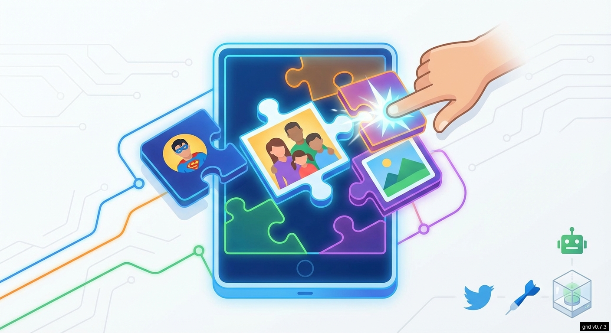
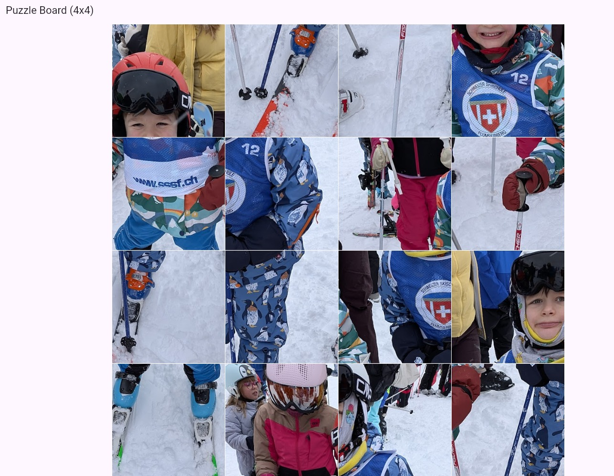

# 🧩 Kids Jigsaw Puzzle Game v1.1.8



> **Goal**: Create an interactive jigsaw puzzle game for kids where they can use their own photos (family, heroes, etc.) and solve puzzles by swapping tiles. Adjacent correct tiles merge automatically!

* [App on GH PAGES](https://palladius.github.io/kids-jigsaw-puzzle/)

## ✅ Tested Platforms

* [x] 🍎 **macOS** (v1.1.5)
* [x] 🐧 **Linux**
* [x] 🌐 **Web**
* [ ] 🤖 **Android**
* [ ] 📱 **iOS** ([How to install on iPhone](doc/how-to-install-on-iphone.md))
* [ ] 🪟 **Windows**



## 🚀 Installation

### macOS (Recommended)

1. **Install Dependencies**: Use [just](https://just.systems/) to install Flutter and CocoaPods:
   ```bash
   just install-mac
   ```
2. **Setup Flutter**: Run the setup script to verify installation:
   ```bash
   just setup-mac
   ```
3. **Xcode**: Ensure you have a full installation of Xcode from the App Store. After installation, run:
   ```bash
   sudo xcode-select --switch /Applications/Xcode.app/Contents/Developer
   sudo xcodebuild -runFirstLaunch
   ```

### Other Platforms
- **Android**: Install [Android Studio](https://developer.android.com/studio) and the Flutter SDK.
- **Linux**: Install Flutter via snap or manual download.
- **Web**: Flutter SDK is sufficient.

<br/>

---

<div align="center">

Made with **Antigravity** by **[Riccardo Carlesso](https://github.com/palladius)**

[](https://github.com/palladius)

</div>
